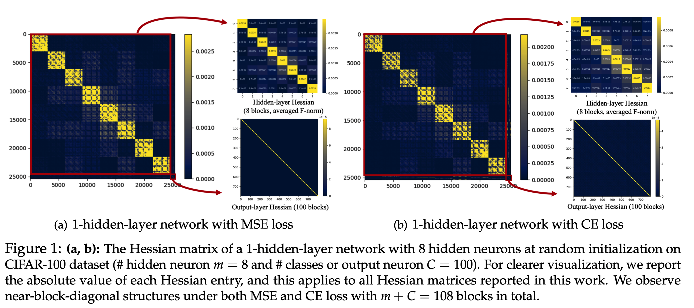

# Towards Quantifying the Hessian Structure of Neural Networks
This repository contains PyTorch implementations of Hessian visualization of neural networks.  Check out more descriptions in our paper 



## How to use 

Install torch (>=1.8.0) and run the following command for the results on CIFAR-100.

```
python train_cifar.py
```

Run the following command for the results on Gaussian synthetic data.

```
python train_gaussian.py
```


## Acknowledgements

The above code is heavily based on the code base of the paper [Why Transformers Need Adam: Hessian Perspective](https://github.com/zyushun/hessian-spectrum).

## Citation

If you find this code helpful, please cite our paper in the following format.

```

```
